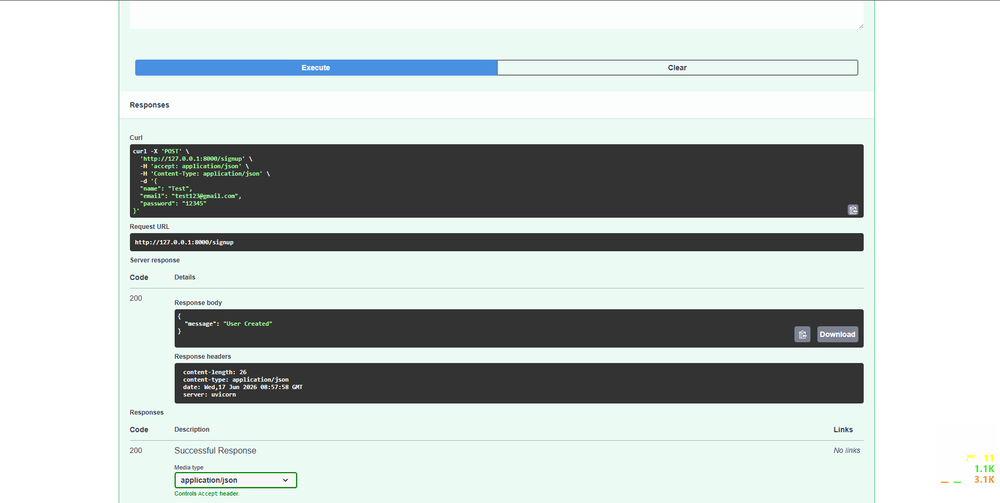
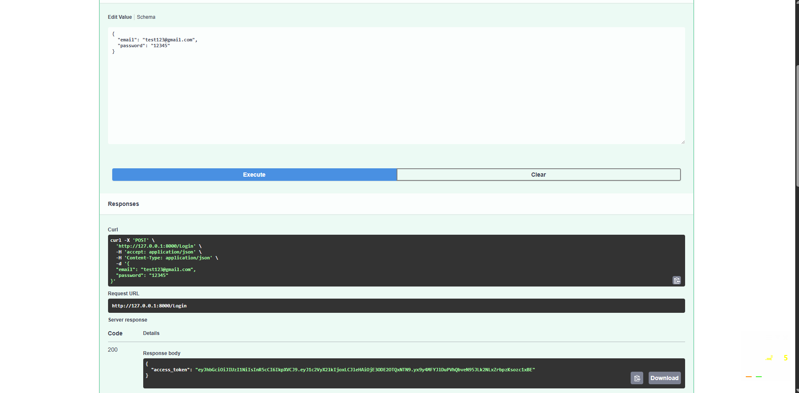
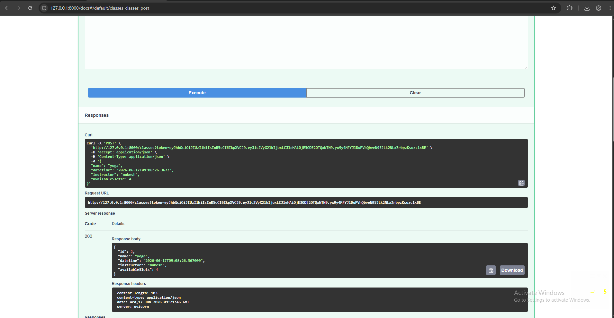
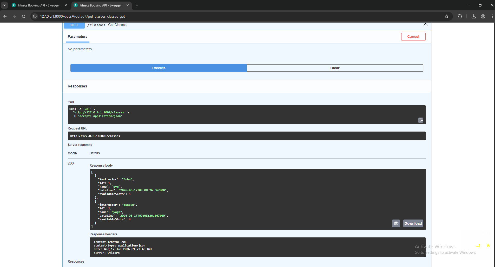
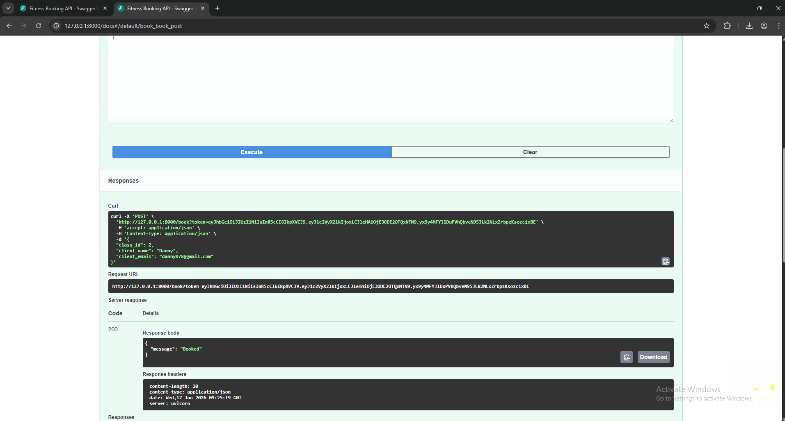
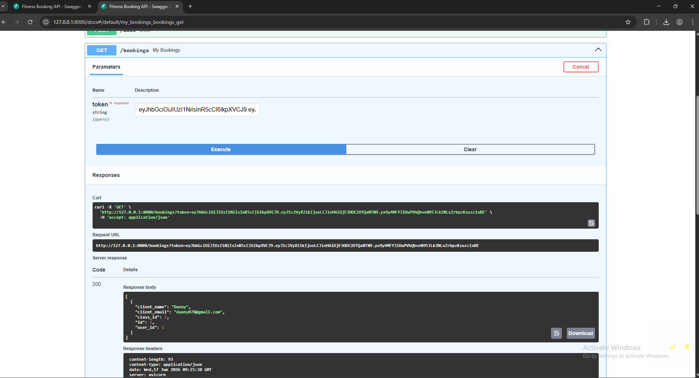

# 🧘 Fitness Studio Booking API

A backend API built using **FastAPI + SQLAlchemy + JWT authentication** for managing a fictional fitness studio.  
Users can register, login, view classes, and book available slots.

---

## 🚀 Features

- User Signup & Login (JWT Authentication)
- Create Fitness Classes (Yoga, gym, yoga 2, etc.)
- View all upcoming classes
- Book a class slot (with validation)
- Prevent overbooking
- View user-specific bookings

---

## 🛠 Tech Stack

- Python 3
- FastAPI
- SQLAlchemy
- SQLite
- JWT (python-jose)
- Passlib (bcrypt)

---
## 📸 Screenshots

### Signup API


### Login API


### classes API


### get_classes API


### Booking API


### Booking API


---

## ⚙️ Setup Instructions

### 1. Clone Repository
```bash
git clone <your-repo-link>
cd project-folder
bash

2. Create Virtual Environment
```bash
python -m venv venv
Activate:
Windows:
bash
venv\Scripts\activate

Mac/Linux:
source venv/bin/activate

3. Install Dependencies
pip install -r requirements.txt

4. Run Server
uvicorn app.main:app --reload
🔐 Authentication
Use JWT token in headers:

Authorization: Bearer <your_token>
## 📌 API Endpoints
🔹 Auth
POST /signup
JSON
{
  "name": "John",
  "email": "john@example.com",
  "password": "1234"
}
POST /login
Response:
JSON
{
  "access_token": "jwt_token_here"
}
🔹 Classes
POST /classes (Auth Required)
Create a new fitness class.
GET /classes
Get all upcoming classes.
🔹 Booking
POST /book (Auth Required)
JSON
{
  "class_id": 1,
  "client_name": "Alice",
  "client_email": "alice@example.com"
}
GET /bookings (Auth Required)
Get all bookings of logged-in user.

## ⚠️ Important Rules Handled
Prevents overbooking
JWT authentication required for protected routes
Duplicate booking prevention
Invalid token handling
User validation

## 📈 Future Improvements
PostgreSQL integration
Role-based access (Admin/User)
Pagination for classes
Unit testing (pytest)
Docker support
Deployment on Render/AWS

## 👨‍💻 Author
Backend Developer Intern Assignment Submission
✅ Status
✔ Completed
✔ Tested
✔ Ready for submission

---

# 📦 requirements.txt (FINAL)

```txt
fastapi
uvicorn
sqlalchemy
passlib[bcrypt]
python-jose
pydantic
